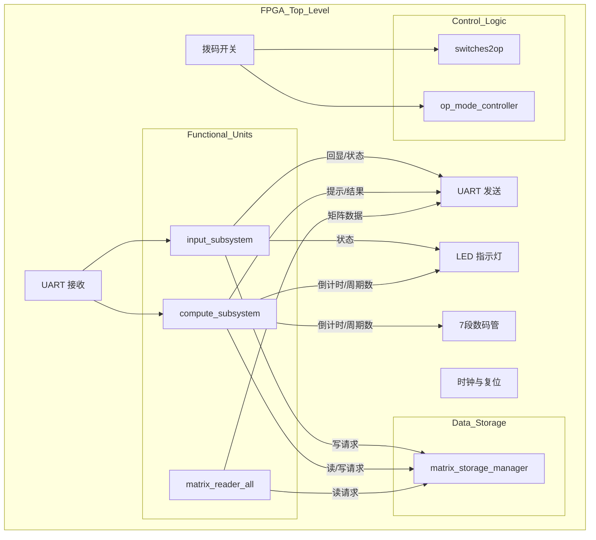

# FPGA 矩阵计算器架构规划

## 1. 系统概述

本系统采用模块化 FPGA 应用设计，由顶层模块 (`top_module`) 统一协调。系统采用基于模式的控制方案，通过板载拨码开关决定当前激活的子系统。

### 核心子系统
1.  **输入子系统 (`input_subsystem`)**: 处理矩阵输入、随机生成和系统设置（通过 UART）。
2.  **计算子系统 (`compute_subsystem`)**: 执行矩阵运算（加、乘、转置、标量乘、卷积）并管理用户交互。
3.  **展示子系统 (`matrix_reader_all`)**: 遍历并通过 UART 展示所有存储的矩阵。
4.  **存储管理器 (`matrix_storage_manager`)**: 集中管理的 BRAM 控制器，用于矩阵存储。

## 2. 顶层架构

## 3. 模块接口与修改计划

### 3.1. `top_module` (新建)
*   **端口定义**:
    *   `clk`: 系统时钟 (100MHz)
    *   `rst_n`: 异步复位 (低电平有效)
    *   `uart_rx`: UART 接收线
    *   `uart_tx`: UART 发送线
    *   `sw`: 拨码开关 [7:0]
    *   `btn`: 按键 (确认键等)
    *   `led`: LED 指示灯 [7:0]
    *   `seg`: 数码管段选 [7:0]
    *   `an`: 数码管位选 [3:0]

### 3.2. `compute_subsystem` (修改)
*   **新增逻辑**:
    *   接收来自 `matrix_op_executor` 的 `cycle_count`（周期计数）。
    *   实例化 `bin_to_bcd` 模块，将周期数转换为 BCD 码。
    *   实例化 `seg7_display` 模块，驱动数码管显示。
    *   **显示多路复用**:
        *   如果 `state == DONE` 且 `op_type == CONV` (卷积): 显示 `cycle_count`。
        *   否则: 显示 `selector` 的输出（倒计时/错误码）。

### 3.3. `matrix_op_executor` (修改)
*   **新增端口**: `output logic [31:0] cycle_count`
*   **逻辑**: 将内部 `op_conv` 模块的 `cycle_count` 连接到输出端口。

### 3.4. `matrix_op_conv` (修改)
*   **新增端口**: `output logic [31:0] cycle_count`
*   **逻辑**: 将 `conv_stat_wrapper.cycle_count` 连接到输出端口。

## 4. 仲裁逻辑

### 4.1. UART 发送仲裁
`uart_tx` 信号由多路复用器驱动，控制信号为当前的运算模式 (`op_mode`，来自 `switches2op`)：

| 模式 | 数据源 | 描述 |
| :--- | :--- | :--- |
| `OP_INPUT` (1) | `uart_rx` (回环) | 简单的回显功能，方便用户看到输入。 |
| `OP_GEN` (2) | `uart_rx` (回环) | 简单的回显功能。 |
| `OP_SHOW` (3) | `matrix_reader_all` | 输出所有矩阵数据。 |
| `OP_CALC` (4) | `compute_subsystem` | 交互式提示和运算结果输出。 |
| `OP_SETTINGS` (5) | `uart_rx` (回环) | 简单的回显功能。 |
| 默认 | 空闲 (高电平) | |

### 4.2. LED 与数码管仲裁
*   **LED 指示灯**:
    *   `LED[0]` (错误 Error): `input_error` | `compute_error`
    *   `LED[1]` (完成 Done): `input_done` | `compute_done` | `reader_done`
    *   `LED[2]` (忙碌 Busy): `input_busy` | `compute_busy` | `reader_busy`
    *   `LED[7:3]`: 调试/状态指示 (如当前模式)。
*   **7段数码管**:
    *   仅由 `compute_subsystem` 驱动。其他模式下关闭（或显示默认值）。

## 5. 实施步骤

1.  **步骤 1**: 修改 `matrix_op_conv.sv`，暴露 `cycle_count` 信号。
2.  **步骤 2**: 修改 `matrix_op_executor.sv`，向上传递 `cycle_count`。
3.  **步骤 3**: 修改 `compute_subsystem.sv`，实现周期计数的显示逻辑。
4.  **步骤 4**: 创建 `top_module.sv`，将所有模块连接起来。
5.  **步骤 5**: 运行仿真进行验证。
