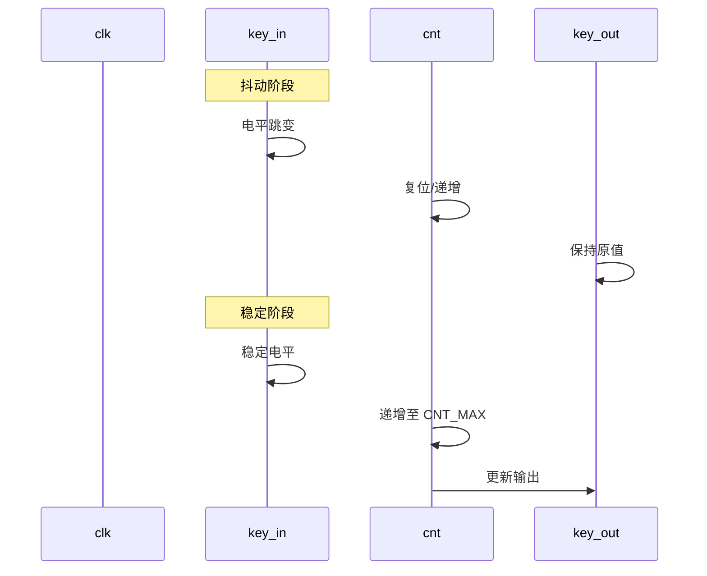

# 按键消抖模块 (Key Debounce)

## 概述
本模块实现了一个用于机械按键或开关的数字消抖滤波器。它确保输出信号仅在输入信号保持稳定达到指定持续时间后才发生跳变，从而滤除按键抖动产生的毛刺。

## 参数
| 参数名 | 类型 | 默认值 | 描述 |
| :--- | :--- | :--- | :--- |
| `CNT_MAX` | `integer` | `20'd2000000` | 消抖计数器阈值。默认在 100MHz 时钟下对应 20ms。 |

## 端口
| 端口名 | 方向 | 位宽 | 描述 |
| :--- | :--- | :--- | :--- |
| `clk` | Input | 1 | 系统时钟 (例如 100MHz)。 |
| `rst_n` | Input | 1 | 异步复位信号，低电平有效。 |
| `key_in` | Input | 1 | 来自物理按键/开关的原始输入信号。 |
| `key_out` | Output | 1 | 消抖后的输出信号。 |

## 功能描述
1.  **同步处理**: 输入信号 `key_in` 通过两级移位寄存器 (`key_d0`, `key_d1`) 同步到时钟域，以防止亚稳态。
2.  **变化检测**: 模块比较同步后的输入 `key_d1` 与当前的输出 `key_out`。
3.  **计数逻辑**:
    *   如果 `key_d1` 与 `key_out` 不同，计数器 `cnt` 开始递增。
    *   如果 `key_d1` 与 `key_out` 相同，计数器清零。
    *   当计数器达到 `CNT_MAX` 时，表示输入信号已稳定保持了所需的时间。此时 `key_out` 更新为 `key_d1` 的值，计数器清零。

## 时序图

