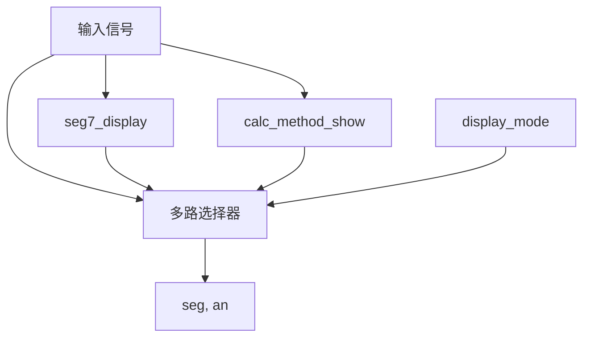

# LED Display Controller 模块设计文档

## 1. 概述
`led_display_ctrl` 是七段数码管显示的顶层控制模块。它集成了数字显示模块 (`seg7_display`) 和字符显示模块 (`calc_method_show`)，并根据控制信号选择输出源。

## 2. 接口定义

| 信号名 | 方向 | 位宽 | 描述 |
| :--- | :--- | :--- | :--- |
| clk | input | 1 | 系统时钟 |
| rst_n | input | 1 | 异步复位，低电平有效 |
| display_mode | input | 2 | 显示模式选择 |
| seg7_valid | input | 1 | seg7_display 的有效信号 |
| bcd_data_0 | input | 4 | seg7_display 输入数据 (Digit 0) |
| bcd_data_1 | input | 4 | seg7_display 输入数据 (Digit 1) |
| bcd_data_2 | input | 4 | seg7_display 输入数据 (Digit 2) |
| bcd_data_3 | input | 4 | seg7_display 输入数据 (Digit 3) |
| method_sel | input | 3 | calc_method_show 的字符选择信号 |
| seg | output | 8 | 最终输出的段选信号 |
| an | output | 4 | 最终输出的位选信号 |

## 3. 功能描述

### 3.1 模式选择
模块根据 `display_mode` 输入决定输出内容：

| display_mode | 模式 | 描述 |
| :--- | :--- | :--- |
| 0 | 数字显示 | 输出 `seg7_display` 模块的信号，显示输入的 BCD 数值。 |
| 1 | 字符显示 | 输出 `calc_method_show` 模块的信号，显示 T, A, B, C, J 等字符。 |
| 2 | 关闭显示 | 强制关闭数码管显示（输出全高电平）。 |
| 其他 | 关闭显示 | 同上。 |

### 3.2 模块实例化
- **seg7_display**: 负责常规的数字显示，支持 4 位 BCD 码输入。
- **calc_method_show**: 负责特定字符显示，支持 5 种预定义字符。

## 4. 结构图

